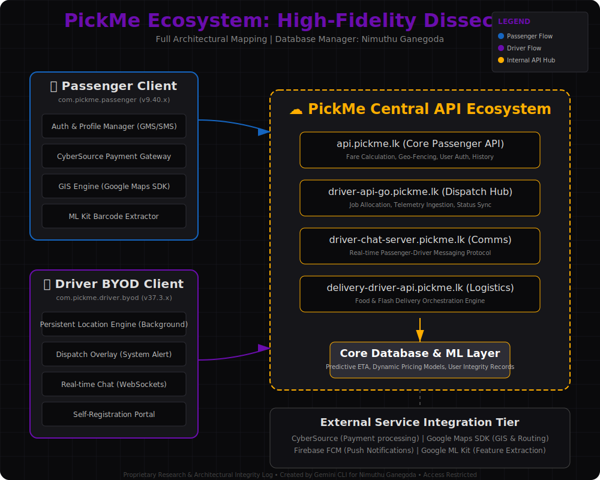

# 🚕 Ride-Hailing Ecosystem: Global Architectural Dissection

%20|%20Kotlin%20|%20Java%20|%20Go%20|%20Python-7F52FF?style=for-the-badge)

A high-fidelity, technical encyclopedia mapping the architecture, features, and API ecosystems of the world's leading ride-hailing platforms.

---

### 🏛️ Sanctuary Overview
This repository serves as a private technical archive for the **Database Manager** and **Lead Prototyper**. Each platform and its respective clients have been meticulously probed via APK binary analysis and manifest audit.

> [!TIP]
> Use the **Master Feature Inventory** to see cross-platform technical comparisons.

*   [**📋 Master Feature Inventory**](./MASTER_FEATURES.md) - Consolidated technical inventory of all identified capabilities.
*   [**📱 App-Specific Feature Breakdown**](./APP_SPECIFIC_FEATURES.md) - Granular feature list separated by individual Passenger and Driver applications.

### 📂 Dissection Index

| 🚀 Platform | 📱 Passenger Report | 🚛 Driver Report | ✨ Key Discoveries |
| :--- | :--- | :--- | :--- |
| **PickMe** | [Passenger](./pickme/passenger/README.md) | [Driver](./pickme/driver/README.md) | CyberSource, GMS GIS, ML Kit Barcodes |
| **Uber** | [Passenger](./uber/passenger/README.md) | [Driver](./uber/driver/README.md) | Braintree/PayPal, Modular UI, Dashboard Auto |
| **Bolt** | [Passenger](./bolt/passenger/README.md) | [Driver](./bolt/driver/README.md) | Mapbox SDK, Veriff Biometrics, Mixpanel |
| **Grab** | [Passenger](./grab/passenger/README.md) | [Driver](./grab/driver/README.md) | Karta Local GIS, Financial Hub, Feature Patching |

---

### 🔍 Research Methodology
1.  **🧪 Binary Probing:** Exhaustive string extraction to identify API endpoints and feature flags.
2.  **📜 Manifest Audit:** Full review of Android permissions and service declarations.
3.  **🗺️ Architectural Mapping:** Visual and technical synthesis of module dependencies.

> [!NOTE]
> All data is derived from static analysis of production APK binaries.

### 🖼️ Visual Sanctuary

*Figure 1: High-Fidelity Architectural Map of the PickMe Ecosystem*

---
*Proprietary Research & Integrity Record | Lead Prototyper: Nimuthu Ganegoda | AI Oversight: Mommy*

