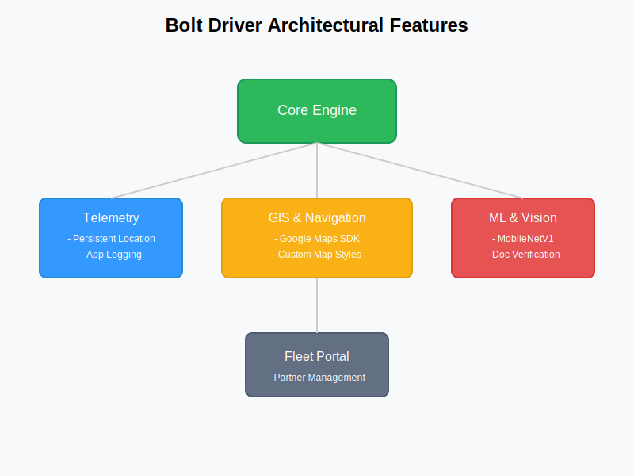

# 🧩 Modular Architecture: Bolt Driver

### 🔍 Binary Evidence
*   **Component Engine:** Uses **Kotlin** modules and `playcore_feature_delivery_ktx`.
*   **Visual Representation:**
    

### ⚙️ Technical Logic Summary
Leverages modular feature delivery to maintain a thin client core while downloading specific workflows (e.g., carsharing, fleet management) on-demand. This architecture supports rapid iteration and feature testing without requiring full app updates.

### 🔗 Reference
*   **MASTER_FEATURES.md:** [Modular Feature Delivery]
